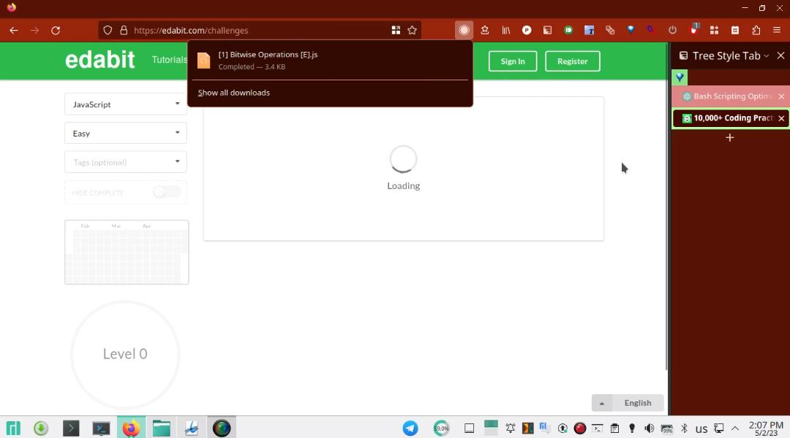

# RONV Overview

This is a shell script designed to help learners organize their practice problems by tracking their progress and making it easier to access and modify completed and unfinished files.
### Requirements
    - bash
    - git
    - vim
    - (the application that can run javascript in backend or outside the browser like 'nodemon')

### Functionality

The script has several functions, each with a specific purpose:

    - promptFile(): Prompts the user to choose a file to work on, and then displays a menu of options to modify, complete, or test the file.
    - menu(): Displays a menu of options for the user to choose from after selecting a file in promptFile().
    - menu2(): Displays a secondary menu of options to continue working on a file after completing or testing it.
    - tagOrNoTag(): Prompts the user to add a tag to their commit, allowing for easier tracking of progress.

### How to Use

To use the script: 

    - You first need to give executable permission to it. You can do that by using the chmod command. 
    - Then, simply run the file in your terminal with ./RONV 'grep pattern' 'testing application'.
    - For example:
    - RONV '.js' 'nodemon'
    - This will run RONV and only select files with extension .js and the application to execute this selected files will be nodemon
    - RONV '[E].py' 'python'
    - This will run RONV and only select files with  '[E}.py' at the end of their name and the application that will execute the file with python shell.
    - After running, the script will prompt the user to select a file to work on. 
    - Once selected, the user can modify, complete, test, or continue working on the file as needed using the menus presented.

### Additional Information

    - The script uses git to track changes and progress, so it is recommended to have git installed and set up before using.
    - The script automatically renames completed files to include 99999 at the beginning of their names, making it easier to sort and find unfinished files.
    - Similarly, the script adds one or more ! characters to the beginning of file names that have been modified, making them easier to find and access.
    - The script constantly loops through the promptFile() function until the user chooses to quit.
    - Also, RONV only uses vim as editor for editing the files. So, it is recommended to have vim installed and set up before using.

# How the problems were scraped from Edabit.com:

To scrape the problems from Edabit.com, a JavaScript was created to run in the browser's console. This script was designed to scrape and save the problem statements in a format that is both portable and does not require separate files for the answers. Instead, the answers could be written directly in the same file as the problem statement and tested within the script. Additionally, the problem statements were saved as comments within the file. This approach was chosen to minimize the need for additional files and make the problems more accessible for learners.

The script can also be adapted to scrape problems in other programming languages from Edabit.com or other similar websites. "scriptToScrapeEdabit.js" have additional parameter at the start of the code that can be modified to scrape custom problems from the edabit.com site.
